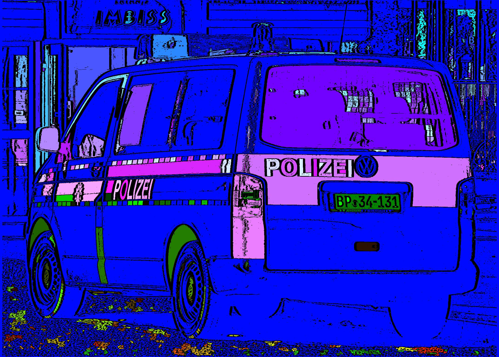
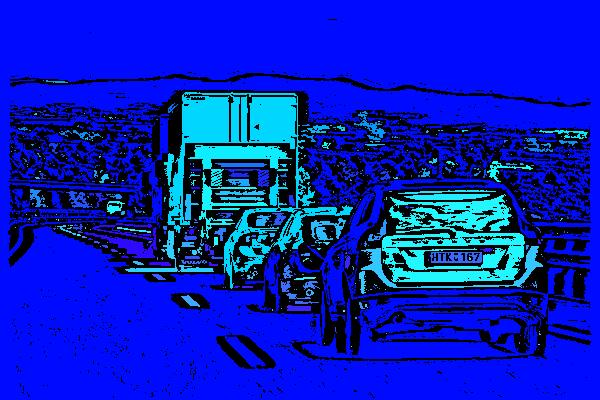

alpr ... automatic license plate recognition


## After Sauvola and Connected Component Labeling

```math
T := C \circ S \circ G
```

with C Component Labeling, S Sauvola(10,2,256,0.25), G Grayscale (50).




